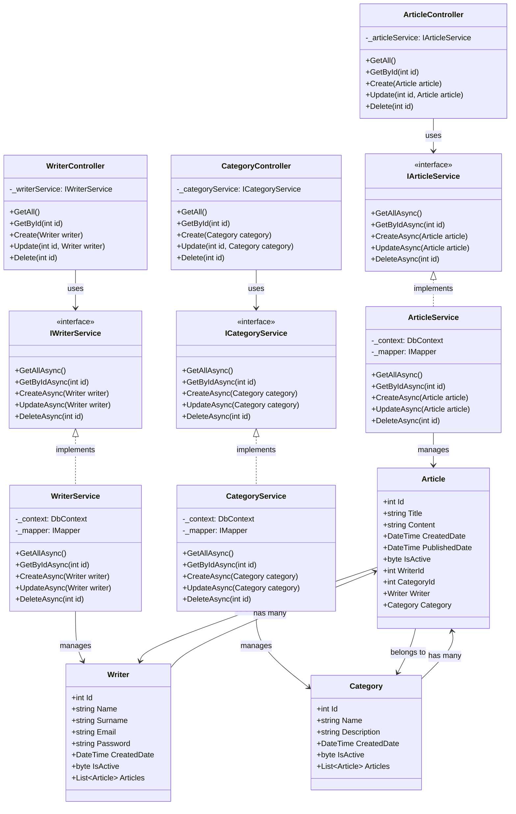
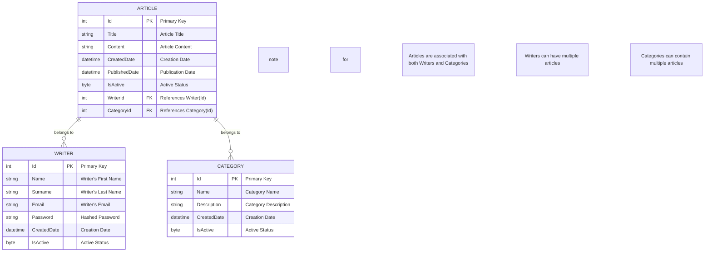

# Definex Ocelot API Gateway Demo

Bu proje, Ocelot API Gateway kullanarak mikroservis mimarisi ile geliştirilmiş bir örnek uygulamadır. Üç mikroservis (Article.Api, Writer.Api ve Category.Api) ve bu servislerle API Gateway üzerinden iletişim kuran bir WebUI uygulaması içermektedir.

## Proje Yapısı

```
DefinexOcelotApiOrnek/
├── ApiGateway/                 # Ocelot API Gateway
├── ApiGateway2/               # Yatay ölçeklendirme için ikinci API Gateway örneği
├── Article.Api/               # Makale mikroservisi
├── Writer.Api/                # Yazar mikroservisi
├── Category.Api/              # Kategori mikroservisi
└── WebUI/                     # Web uygulaması (MVC)
```

## Özellikler

- **Mikroservis Mimarisi**
  - Makale Yönetimi
  - Yazar Yönetimi
  - Kategori Yönetimi
  - Ocelot API Gateway
  - Yatay Ölçeklendirme Desteği

- **Web Arayüzü Özellikleri**
  - İstatistik panosu
  - Makaleler için CRUD işlemleri
  - Yazarlar için CRUD işlemleri
  - Kategoriler için CRUD işlemleri
  - Bootstrap ile responsive tasarım
  - Form doğrulama
  - Hata yönetimi

## Sistem Gereksinimleri

- .NET 7.0 SDK veya üzeri
- Visual Studio 2022 veya üzeri
- SQL Server (LocalDB veya Express)

## Port Yapılandırması

- **API Gateway**: https://localhost:5003
- **API Gateway 2**: https://localhost:5006
- **Article.Api**: https://localhost:5001
- **Writer.Api**: https://localhost:5002
- **Category.Api**: https://localhost:5004
- **WebUI**: https://localhost:5000

## Başlangıç

1. **Projeyi Klonlama**
   ```bash
   git clone [repository-url]
   cd DefinexOcelotApiOrnek
   ```

2. **Veritabanı Kurulumu**
   - Her mikroservisin kendi veritabanı vardır
   - Gerekirse `appsettings.json` dosyalarındaki bağlantı dizelerini güncelleyin
   - Her mikroservis için migration'ları çalıştırın:
     ```bash
     cd Article.Api
     dotnet ef database update
     
     cd ../Writer.Api
     dotnet ef database update
     
     cd ../Category.Api
     dotnet ef database update
     ```

3. **Uygulamayı Çalıştırma**
   - Mikroservisleri aşağıdaki sırayla başlatın:
     1. Article.Api
     2. Writer.Api
     3. Category.Api
     4. ApiGateway
     5. ApiGateway2 (isteğe bağlı, yatay ölçeklendirme için)
     6. WebUI

   - Visual Studio'da birden fazla projeyi aynı anda çalıştırmak için:
     1. Solution'a sağ tıklayın
     2. "Configure Startup Projects" seçin
     3. "Multiple startup projects" seçin
     4. Tüm projeler için "Start" aksiyonunu ayarlayın

## API Endpoint'leri

### Article.Api
- GET /api/articles
- GET /api/articles/{id}
- POST /api/articles
- PUT /api/articles/{id}
- DELETE /api/articles/{id}

### Writer.Api
- GET /api/writers
- GET /api/writers/{id}
- POST /api/writers
- PUT /api/writers/{id}
- DELETE /api/writers/{id}

### Category.Api
- GET /api/categories
- GET /api/categories/{id}
- POST /api/categories
- PUT /api/categories/{id}
- DELETE /api/categories/{id}

## API Gateway Rotaları

Tüm istekler API Gateway üzerinden aşağıdaki pattern ile yönlendirilir:
- GET /gateway/articles
- GET /gateway/articles/{id}
- POST /gateway/articles
- PUT /gateway/articles/{id}
- DELETE /gateway/articles/{id}

Benzer pattern'ler yazarlar ve kategoriler için de mevcuttur.

## Kullanılan Teknolojiler

- ASP.NET Core 7.0
- Entity Framework Core
- Ocelot API Gateway
- Bootstrap 5
- jQuery
- SQL Server

## Mimari

Uygulama aşağıdaki özelliklere sahip bir mikroservis mimarisi kullanır:
1. Her mikroservisin kendi veritabanı vardır
2. Servisler arası iletişim API Gateway üzerinden sağlanır
3. WebUI uygulaması mikroservislerle API Gateway üzerinden iletişim kurar
4. Yatay ölçeklendirme için birden fazla API Gateway örneği desteklenir

## Sınıf Diyagramı



## Veritabanı Şeması



## Hata Yönetimi

- Her mikroservis uygun hata yönetimi içerir
- API Gateway hata yönetimi ve rate limiting içerir
- WebUI kullanıcı dostu hata mesajları gösterir
- Tüm bileşenlerde loglama uygulanmıştır

## Güvenlik

- Tüm servisler için HTTPS etkinleştirilmiştir
- API Gateway rate limiting içerir
- Tüm formlarda giriş doğrulama uygulanmıştır
- Entity Framework ile SQL injection önlemi

## Katkıda Bulunma

1. Projeyi fork edin
2. Feature branch oluşturun
3. Değişikliklerinizi commit edin
4. Branch'inizi push edin
5. Pull Request oluşturun

## Lisans

Bu proje MIT Lisansı altında lisanslanmıştır - detaylar için LICENSE dosyasına bakın. "# Definex_Ocelot_Api_Ornek" 
